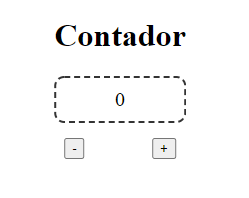

    

### Exercicios de fixação para vueJS
Primeiros passos para usar a [biblioteca do vue](https://vuejs.org/), seguindo a documentação oficial.

### Projetos simples:
Todos os projetos são simples, não para a estilização e sim para entender o funcionamento do vue.

---

### Exercicios:
1.  [Contador de cliques](1-contador.html)