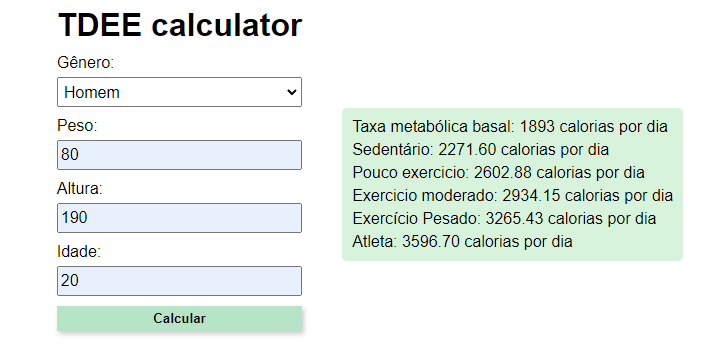

    
    

### Exercicios de fixação para vueJS
Primeiros passos para usar a [biblioteca do vue](https://vuejs.org/), seguindo a documentação oficial.

### Projetos simples:
Todos os projetos são simples e focados no funcionamento do vue.

---

### Exercicios:
1. [Contador de cliques](1-contador.html)
2. [TDEE calculator](2-tdeecalculator.html)